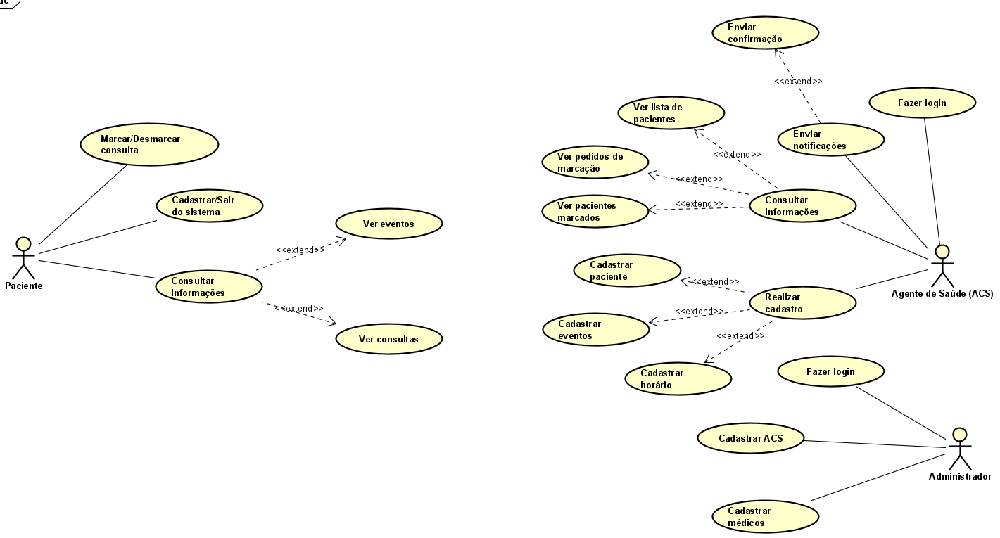

# Projeto APS

## Grupo

- Pedro Meira-Betmann (pm)
- João Placido da Silva Neto (jpsn)
- Lucas Yule Rocha de Melo Araujo (lyrma)
- Andrey Romeiro Moutelik de Aguiar (arma2)

## Proposta de Aplicação

Um sistema para ajudar agentes de saúde na marcação de consultas. Um chatbot acoplado ao telegram para que os pacientes sejam capazes de pedir a marcação de consultas, junto com informações dos horários possíveis e eventos da unidade de saúde. No lado da agente de saúde ela tem uma lista dos pedidos de marcação e as opções de dizer é foi possível marcar a consulta na data desejada pelo paciente e assim o bot manda a mensagem automaticamente confirmando a consulta e no caso de não conseguir marcar a consulta o bot manda uma mensagem avisando que não foi possível fazer a marcação para a data desejada.

## Slide: [Slide entrega 2](https://docs.google.com/presentation/d/1rr6ktON3pIaor4Bdq6IipMGjfV5x37rnXnMhu0dCxTo/edit#slide=id.g1449ac61b45_0_438)  
## Especificação de casos de uso

